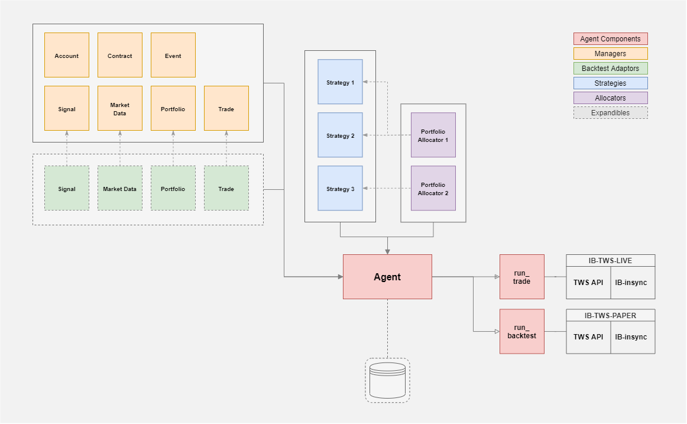

# Forge - the Automated Trading App [Shadow]

  

This repository as a shadow page containing the sample modules of the whole project serves the purposes of demonstrating the structure and functionality of the full development. Trade functionalities are in place while the backtesting and server side components remain expandible in design.

## Description
This trading bot leverages the [IB_insync](https://ib-insync.readthedocs.io/readme.html) package which offers an high-level asynchronous framework in working with the Interactive Brokers TWS API / IB Gateway for automated trading. For the time being it is designed for regular trade horizon with mid-low frequency and suitable for strategies with bounded running cycle. The framework consists of three main layers and a core running agent which control the runtime pipeline:

- **Agent**: The core class to be entended for easy runtime piplining integration of customized strategies/allocators.
- **Manager Layer**: Consists of seven managers that govern the behavior of:
   - *Account*: Extracts and translates the brokerage account information.
   - *Contract*: Requests and inventorizes the IB contract objects for different securities. 
   - *Event*: Responsible for API message handling and interfacing for event-driven actions.
   - *Market Data*: Responsible for the harvest and governance of market data including bar, real-time FX, status data.
   - *Portfolio*: Extracts and translates the portfolio information with relevant functions.
   - *Signal*: Interface and inventory for internal signal generation.
   - *Trade*: Interface and inventory for trade order management.
- **Strategy Layer**: Consists of user-defined trade or backtesting strategies for signal generation. 
- **Allocator Layer**: Consists of user-defined portfolio allocation strategies which collects generated signals and creates weighted trade orders.

All component behavior are controlled by the settings in main config. 

## Example
See the example in run_trading.py for the generate setup. All integrated components are required to implement the interface with initialize() and update():
- **Initialize()**: define the initialization of every single component prior to the start of the trading inteval.  
- **Update()**: At each (mixed-)regular time interval this will be called for all components.

## Disclaimer
The article and the relevant codes and content are purely informative and none of the information provided constitutes any recommendation regarding any security, transaction or investment strategy for any specific person. The implementation described in the article could be risky and the market condition could be volatile and differ from the period covered above. All trading strategies and tools are implemented at the users’ own risk.
